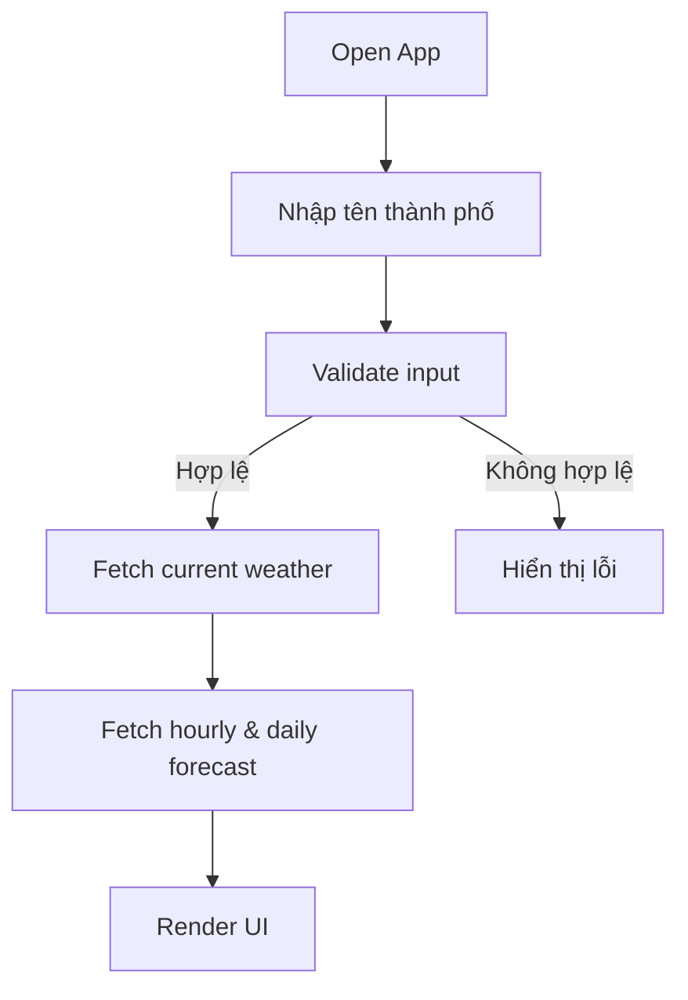
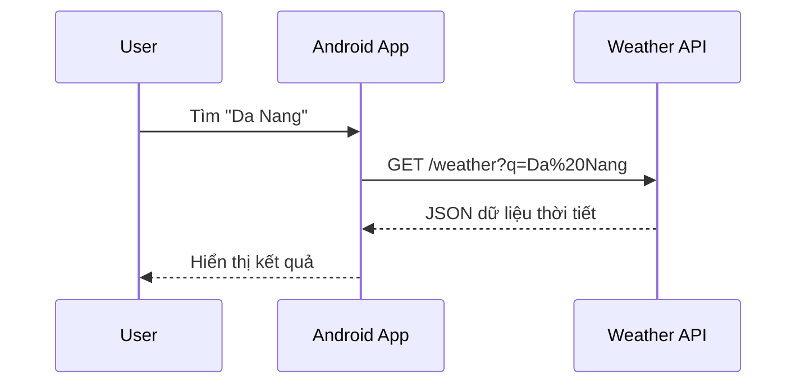

# Weather App

> Ứng dụng thời tiết Android hiển thị thông tin thời tiết hiện tại, dự báo theo giờ và theo ngày — đơn giản, nhanh, đẹp.


---

## 📱 Tính năng

-  **Tìm kiếm thành phố** theo tên
-  **Thời tiết hiện tại**: nhiệt độ, độ ẩm, tốc độ gió, mô tả
-  **Dự báo theo giờ** (24 giờ tới)
-  **Dự báo theo ngày** (7 ngày tới)
-  **Định vị GPS** tự động lấy thời tiết vị trí hiện tại

---

## 🗺️ Luồng hoạt động





---

## 🛠️ Công nghệ sử dụng

| Thành phần | Công nghệ |
|---|---|
| Ngôn ngữ | Java / Kotlin |
| Giao diện | XML Layouts / Jetpack Compose |
| Mạng | Retrofit + OkHttp |
| Parse JSON | Gson / Moshi |
| API thời tiết | [OpenWeatherMap API](https://openweathermap.org/api) |
| Định vị | Android FusedLocationProvider |
| Hình ảnh | Glide / Coil |

---

## 🚀 Cài đặt & chạy thử

### Yêu cầu
- Android Studio **Flamingo** trở lên
- Android SDK **21+**
- API Key từ [OpenWeatherMap](https://openweathermap.org/api)

### Các bước

```bash
# 1. Clone repository
git clone https://github.com/QuoocsCuongwf/Weather-app.git
cd Weather-app

# 2. Mở bằng Android Studio
# File → Open → chọn thư mục project

# 3. Thêm API Key
# Tạo file local.properties (nếu chưa có) và thêm:
WEATHER_API_KEY=your_api_key_here

# 4. Build & Run
# Nhấn Run ▶ hoặc Shift + F10
```

> ⚠️ **Lưu ý:** Không commit API key lên GitHub. File `local.properties` đã được thêm vào `.gitignore`.

---

## 📁 Cấu trúc thư mục

```
Weather-app/
├── app/
│   ├── src/
│   │   ├── main/
│   │   │   ├── java/com/.../
│   │   │   │   ├── ui/          # Activities, Fragments
│   │   │   │   ├── viewmodel/   # ViewModel (MVVM)
│   │   │   │   ├── repository/  # Data layer
│   │   │   │   ├── model/       # Data classes
│   │   │   │   └── network/     # API service, Retrofit
│   │   │   └── res/
│   │   │       ├── layout/      # XML layouts
│   │   │       └── drawable/    # Icons, backgrounds
│   └── build.gradle
├── local.properties             # (không commit)
└── README.md
```

---

## 📸 Giao diện

> *(Thêm screenshot ứng dụng vào đây)*

| Màn hình chính | Dự báo theo giờ | Dự báo 7 ngày |
|:-:|:-:|:-:|
|  |  |  |

---

## 🤝 Đóng góp

Mọi đóng góp đều được chào đón! Vui lòng:

1. Fork repository
2. Tạo branch mới: `git checkout -b feature/ten-tinh-nang`
3. Commit thay đổi: `git commit -m "feat: thêm tính năng X"`
4. Push lên branch: `git push origin feature/ten-tinh-nang`
5. Tạo Pull Request

---

## 📄 Giấy phép

Dự án sử dụng giấy phép [MIT](LICENSE).

---

<div align="center">
  Made with ❤️ by <a href="https://github.com/QuoocsCuongwf">QuoocsCuongwf</a>
</div>