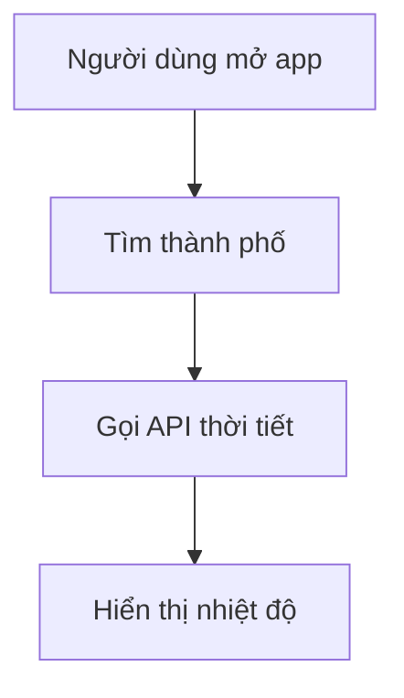
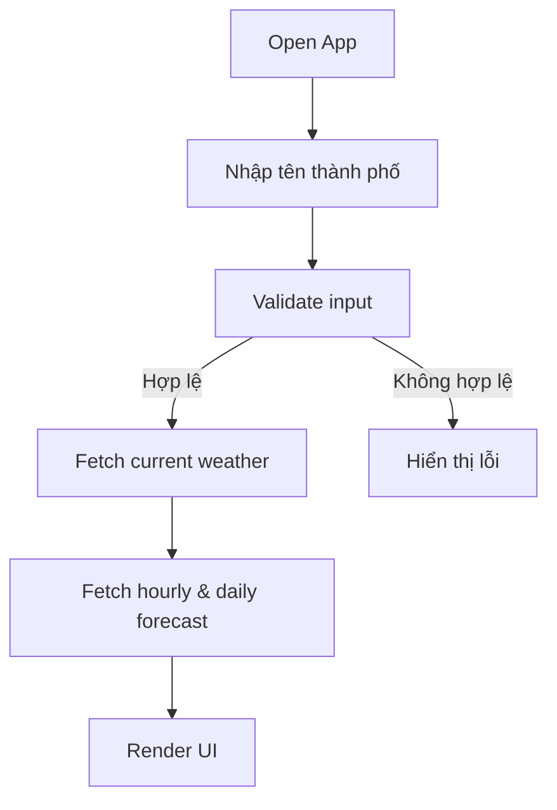
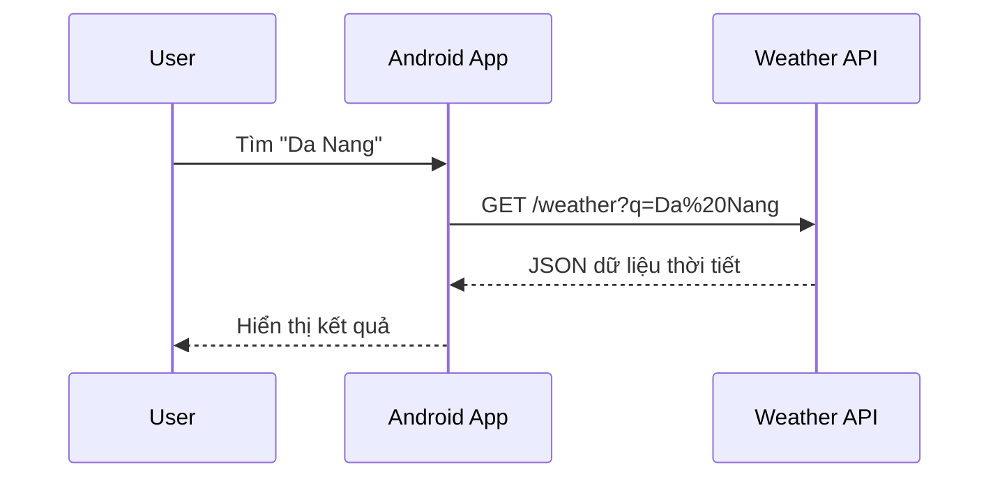
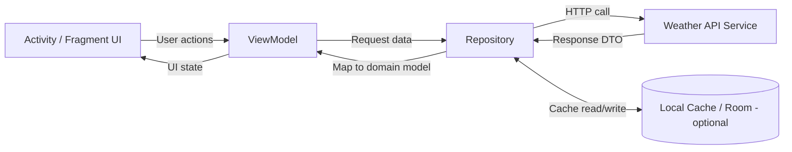

# Weather App

README này hướng dẫn cách vẽ sơ đồ bằng **Mermaid** (bạn gõ “Maidmer” có thể là “Mermaid”).

## Mermaid là gì?
Mermaid là cú pháp text để tạo sơ đồ tự động (flowchart, sequence, class, state, ERD...).  
Bạn chỉ cần viết code dạng markdown, GitHub sẽ render thành sơ đồ.

## Cách dùng nhanh
Trong file `.md`, tạo block:

```markdown

```

## Ví dụ sơ đồ luồng cho app thời tiết



## Ví dụ sequence diagram



## Sơ đồ kiến trúc (UI -> ViewModel -> Repository -> API)



Luồng chính: UI nhận thao tác người dùng, ViewModel điều phối trạng thái, Repository xử lý nguồn dữ liệu (remote/local), và API trả dữ liệu thời tiết về để hiển thị.

## Mẹo
- Dùng [Mermaid Live Editor](https://mermaid.live) để preview nhanh.
- Giữ tên node ngắn, rõ nghĩa.
- Tách sơ đồ lớn thành nhiều sơ đồ nhỏ để dễ đọc.
